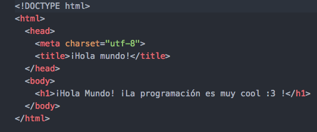

# Quiz #1
- Tipo: `quiz`
- Formato: `guided-learning`
- Duración: `30min`

## Objetivos

- En esta sección tendrás la oportunidad de evaluarte para que pongas tus conocimientos a prueba. Es una oportunidad para que te calibres y valides que realmente estás aprendiendo. ¡Mucho éxito!

## Preguntas

**1) Completa el siguiente enunciado: "Las etiquetas HTML siempre serán nodos de tipo _______.**
  1. Texto.
  2. Comentario.
  3. Elemento.
  4. Atributo.

<solution style="display:none;">3</solution>

**2) En la siguiente imagen:**

**El texto "¡Hola Mundo! ¡La programación es muy cool :3 !" entre las etiquetas
 h1, corresponde a un nodo tipo ______.**
  1. Condicional.
  2. Texto.
  3. Elemento.
  4. Atributo.

<solution style="display:none;">2</solution>

**3) El DOM permite A lxs programadorxs:**
  1. Entrar a los elementos de una página html y modificar sus propiedades.
  2. Acceder a los elementos del navegador y modificarlos.
  3. Dominar el mundo de la programación.
  4. Crear bucles y condicionales.

<solution style="display:none;">1</solution>

**4) ¿Cuando quiero acceder u obtener un elemento único de mi página web, ¿Qué método/métodos
de selección del DOM puedo utilizar?**
  1. .getElementByTagName()
  2. .getElementsByClassName();
  3. .getElementById();
  4. .querySelector();

<solution style="display:none;">3</solution>

**5) Para acceder a elementos de mi página web que tienen la misma etiqueta HTML,
 ¿Qué método/métodos del DOM puedo utilizar?**
  1. .getElementsByTagName()
  2. .getElementsByClassName();
  3. .getElementById();
  5. .querySelector();

<solution style="display:none;">1</solution>

**6) Selecciona los objetos del BOM**
  1. Location
  2. Screen
  3. HTMLtags
  4. Navigator

<solution style="display:none;">1,2,4</solution>

**7) ¿Para qué puedo utilizar los atributos data?**
  1. Para agregar estilos a través de css a un elemento del HTML.
  2. Para identificar a un elemento del DOM.
  3. Para obtener el valor de una entrada de texto.
  4. Para almacenar  datos en las etiquetas HTML sin modificar la presentación del documento.

<solution style="display:none;">4</solution>

**8) ¿A través de qué método eliminas un nodo del DOM?**
  1. elementoPadre.removeAttribute(nombre_del_nodo)
  2. elementoPadre.appendChild(nombre_del_nodo)
  3. elementoPadre.removeChild(nombre_del_nodo)
  4. elementoPadre.removeNode(nombre_del_nodo)

<solution style="display:none;">3</solution>

**9) ¿Con qué método creas un evento?**
  1. .addEventListener('____', funcion_a_ejecutar);
  2. .createEvent(' _____',funcion_a_ejecutar);
  3. .createElement('_____');
  4. .actionListener('_____');

<solution style="display:none;">1</solution>

**10) ¿Qué son los eventos?**
  1. Acciones que realiza el navegador cuando algo no anda bien.
  2. Acciones que se desencadenan a partir de la interacción del usuario con
  un elemento de la página web.
  3. fechas importantes para el navegador.

<solution style="display:none;">2</solution>

[Continuar]( )
