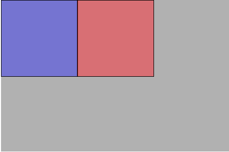

# Quiz #1

- Tipo: `quiz`
- Formato: `self-paced`
- Duración: `30min`

***

## Objetivos

- En esta sección tendrás la oportunidad de evaluarte para que pongas tus
  conocimientos a prueba. Es una oportunidad para que te calibres y valides que
  realmente estás aprendiendo. ¡Mucho éxito!

***

## Preguntas

### 1) ¿Qué es HTML?

#### Opciones

1. Lenguaje de programación
2. Lenguaje de marcado
3. Hoja de estilo
4. Herramienta de código abierto

<solution style="display:none;">2</solution>

### 2) ¿A qué se refiere el 'Anidamiento HTML'?

#### Opciones

1. Al inicio del documento HTML
2. Indica al navegador que el documento es HTML5
3. Agrega una línea para que el `html` aparezca en la segunda línea
4. Que un elemento puede contener a otros elementos o etiquetas HTML

<solution style="display:none;">4</solution>

### 3) ¿Cuáles son las etiquetas que no necesitan cierre?

#### Opciones

1. em
2. div
3. img
4. p

<solution style="display:none;">3</solution>

### 4) Ejemplo correcto de anidación

#### Opciones

1. `<p>Soy una <strong>excelente</p> <em>coder</em></strong>`
2. `</p>Soy una </strong>excelente<strong> </em>coder<em><p>`
3. `<p>Soy una <strong>excelente</strong> <em>coder</em></p>`

<solution style="display:none;">3</solution>

### 5) ¿Cuáles son las características de un elemento en bloque?

#### Opciones

1. No comienzan con la nueva línea.
2. Comienzan en una nueva línea
3. Pueden comenzar en cualquier parte de una línea
4. Pueden contener elementos en línea y otros elementos en bloque

<solution style="display:none;">2,4</solution>

### 6) Las propiedades CSS son `case-sensitive` (toman en cuenta las minúsculas y mayúsculas)

```css
ul {
  MaRgiN: 10px;
}
```

#### Opciones

1. Verdadero
2. Falso

<solution style="display:none;">2</solution>

### 7) ¿Cuál es la diferencia entre `display: inline-block` y `display: inline`?

#### Opciones

1. A un elemento inline no se le puede determinar dimensiones, mientras que a
   uno inline-block sí
2. A un elemento inline-block no se le puede determinar dimensiones, mientras
   que a uno inline sí
3. No hay diferencias entre ambos
4. Un elemento inline no aparece en pantalla, mientras que un inline-block sí

<solution style="display:none;">1</solution>

### 8) ¿Cuál es la sintaxis correcta para la etiqueta `img`?

#### Opciones

1. `<image src="foto.jpg" alt="Foto"></image>`
2. `<image href="foto.jpg" alt="Foto">`
3. ``
4. ``
5. `</img>`

<solution style="display:none;">4</solution>

### 9) ¿Las propiedades `margin-top` y `margin-bottom` tienen efecto sobre elementos inline?

#### Opciones

1. Sí
2. No

<solution style="display:none;">2</solution>

### 10) ¿Las propiedades `padding-top` y `padding-bottom` incrementan el tamaño de un elemento inline?

#### Opciones

1. Sí
2. No

<solution style="display:none;">2</solution>

### 11) Dado el siguiente estilo CSS, ¿qué color tendrán los `<h3>`?

```css
h3 {
  color: red;
}

h3 {
  color: blue;
}

h2 {
  color: yellow;
}
```

#### Opciones

1. red
2. blue
3. yellow

<solution style="display:none;">2</solution>

### 12) ¿Qué orden prevalece para asignar un estilo?

#### Opciones

1. Especificidad, orden del código e importancia
2. Importancia, especificidad y orden del código
3. Orden del código, importancia y especificidad

<solution style="display:none">2</solution>

### 13) Según el siguiente código, ¿cuál será el color del elemento `.phrase`?

**HTML:**

```html
<p id="quote">
  <strong class="subject">Laboratoria</strong>
  <em class="phrase">código que transforma</em>
</p>
```

**CSS:**

```css
#quote {
  color: #FAB541;
}

.phrase {
  color: blue;
}

#quote .phrase {
  color: initial;
}
```

#### Opciones

1. `#FAB541`
2. Azul
3. Por defecto del navegador (negro)

<solution style="display:none">3</solution>

### 14) Tomando en cuenta el siguiente código, ¿cuál es el color del texto **JavaScript**?

**HTML:**

```html
<ul class="programming-languages" id="awesome">
  <li><span>Python</span></li>
  <li class="favorite" id="must-use"><span class="highlight">JavaScript</span></li>
</ul>
```

**CSS:**

```css
ul li {
  color: red;
}

#must-use {
  color: blue;
}
```

#### Opciones

1. Negro
2. Azul
3. Rojo

<solution style="display:none;">2</solution>

### 15) Tomando en cuenta el siguiente código, ¿cuál es el color del texto **JavaScript**?

**HTML:**

```html
<ul class="programming-languages" id="awesome">
  <li><span>Python</span></li>
  <li class="favorite" id="must-use"><span class="highlight">JavaScript</span></li>
</ul>
```

**CSS:**

```css
ul.programming-languages li .highlight {
  color: red;
}

ul.programming-languages li .highlight:nth-of-type(odd) {
  color: blue;
}
```

#### Opciones

1. Rojo
2. Negro
3. Azul

<solution style="display:none;">3</solution>

### 16) Teniendo en cuenta el `HTML` y el resultado, ¿cuál sería el `CSS` necesario para lograrlo?

**HTML:**

```html
<div class="container">
  <div class="box red"></div>
  <div class="box blue"></div>
</div>
```

**RESULTADO:**



#### Opciones

1. `.container` con `position: relative;` y `.red` con `position: absolute;` y
   `left: 200px;`
2. `.container` con `position: fixed;` y `.red` con `left: 200px;`
3. `.red` con `position: absolute;` y `left: 200px;`
4. `.red` con `position: relative;` y `left: 200px;`

<solution style="display:none">1</solution>

### 17) Tomando en cuenta el siguiente código, ¿qué pasará con la posición de `#example`?

**HTML:**

```html
<p id="example">Hello!</p>
```

**CSS:**

```css
#example {
  margin-bottom: 5px;
}
```

#### Opciones

1. Se moverá `5px` hacia abajo
2. Todos los elementos siguientes empezarán `5px` más abajo
3. Ninguno

<solution style="display:none;">2</solution>

### 18) ¿Qué sucede con los elementos en línea cuando se vuelve flotante?

#### Opciones

1. Se mantiene como elemento en línea
2. Se vuelve un elemento en bloque

<solution style="display:none">2</solution>

### 19) Selecciona las propiedades que corresponden a las tipografías

#### Opciones

1. font-size
2. font-color
3. font-family
4. font-weight
5. float

<solution style="display:none">1,3,4</solution>
