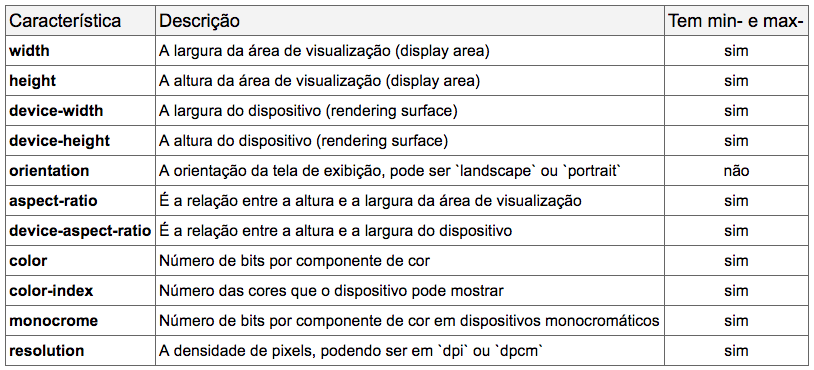

# Media Queries

- Tipo: `lectura`
- Formato: `self-paced`
- Duración: `10min`

***

## Objetivos de Aprendizaje

- Conocer y entender el uso de media queries dentro del Responsive Web Design

## ¿Qué son los Media Queries?

Es una técnica introducida en CSS3, que usa la regla @media para incluir un bloque de propiedades CSS que se ejecutarán en nuestro sitio solo si las condiciones dadas al @media son verdaderas.

Las reglas Media Query están conformadas por Media Types, Media Feature y el bloque de código a ejecutar si las condiciones entregadas en el media type y el media feature son verdaderas. Todo esto se conecta gracias a los operadores lógicos correspondientes.

Los media types corresponden a los distintos dispositivos donde se puede visualizar nuestro sitio web. En la siguiente imagen, se pueden ver los distintos media types que pueden ocuparse.

Los media feature corresponden a la condición que debe cumplir el dispositivo y la cual debe ser verdadera para que se aplique el código contenido en nuestra media query.

Los media features más comunes son los referidos a las dimensiones de pantalla del dispositivo, pudiendo establecer el alto y ancho en el que se aplicarán (con height y width), o lo que es más interesante, a partir de que ancho o alto se aplicarán (con min/max-width y min/max-height). También existen otras, como por ejemplo aquellas combinadas que la orientación del dispositivo (landscape o portrait) o incluso las que definen el ratio de píxeles de la pantalla, como device-pixel-ratio.

## ¿Cómo utilizo Grid System?

Tenemos un esbozo muy sencillo de como podría ser nuestro sitio: 

