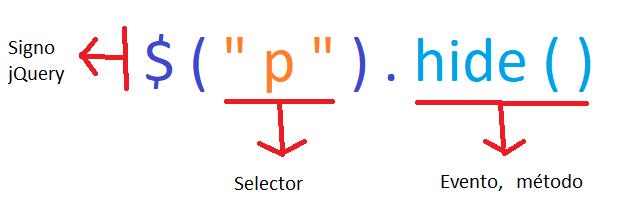

# jQuery

- Tipo: `lectura`
- Formato: `self-paced`
- Duración: `60min`

***

## Objetivos de aprendizaje

- Conocer quién es este nuevo amigo
- Saber cómo lo incluimos en nuestros proyectos

## ¿Qué es jQuery?

Ya nos queda claro que este nuevo amigo se lleva súper bien con los frameworks
de CSS, pero en realidad conocemos muy poco de él, así que en esta lección
vamos a profundizar en su información para poder conocerlo mejor y entonces ver
si lo incluimos en nuestro círculo de nuevas amistades o no.

[jQuery](https://jquery.com/) es una biblioteca de JavaScript (**no** es un
**framework**) y nos ofrece las siguientes características:

- Facilita la manera de interactuar con los documentos HTML
- Manipulación del DOM
- Manejar eventos
- Desarrollar animaciones
- Agregar interacciones con AJAX

### ¿Cómo lo incluimos?

Para incluirlo en nuestro proyecto contamos con dos opciones:

1. [Descargando](http://jquery.com/download/) la biblioteca de jQuery e
   incluirla en el proyecto.

   ```html
   <script src=”jquery-3.2.1.min.js”></script>
   ```

2. Incluyendo el [CDN](https://code.jquery.com/) de jQuery.

   ```html
   <script src="https://code.jquery.com/jquery-3.2.1.min.js"></script>
   ```

Debemos recordar enlazar nuestro jQuery antes que otros scripts,
ya que muchos frameworks e incluso nuestro propio código dependerán de
esta biblioteca.

### Ok, ya queremos usarlo

Ya casi estamos listas para probar, equivocarnos, iterar y triunfar!

La sintaxis de jQuery está hecha para seleccionar elementos de HTML y realizar
alguna acción sobre el elemento.

La sintaxis básica de jQuery es:

```js
$('selector').evento();
```

- El signo `$()` nos indica que estamos trabajando con jQuery
- El `'selector'` es el/los elementos HTML a encontrar y/o consultar
- El `.evento()` es la acción que se realizará con el elemento. El paréntesis
  que lleva puede ir vacío o con una función o parámetros, según lo que se
  esté utilizando.


Ejemplos:

```js
$(this).hide() - oculta el elemento actual.

$("p").hide() - oculta todos los elementos <p>.

$(".test").hide() - oculta todos los elementos con class = "test".

$("#test").hide() - oculta el elemento con id = "prueba".
```

Ya que incluimos jQuery en nuestro proyecto y tenemos clara la sintaxis,
necesitamos indicar o esperar que nuestro documento este completamente cargado
y listo antes de trabajar con él.

Así que en nuestro archivo `js` usamos:

```js
$(document).ready(function() {
  //código a ejecutar
});
```

- Tal como explicamos más arriba, al utilizar `$(document)` sabemos que estamos
  utilizando jQuery y además, especificamos que vamos a manipular el documento
  HTML.

  > **Nota:** `document` no es un elemento HTML, por eso no va entre comillas.

- `.ready()` es un método de jQuery que ejecuta una función hasta que se cargue
  por completo el DOM.

El código completo se utiliza para decirle a nuestro código que se ejecute
en cuanto se cargue el documento de nuestra página.

#### La filosofía de jQuery es: *¨Write less, do more¨*

Y no se tú, pero a mi parecer nuestro círculo de amigos va en aumento!
